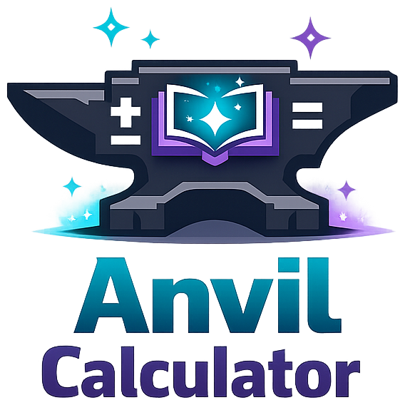
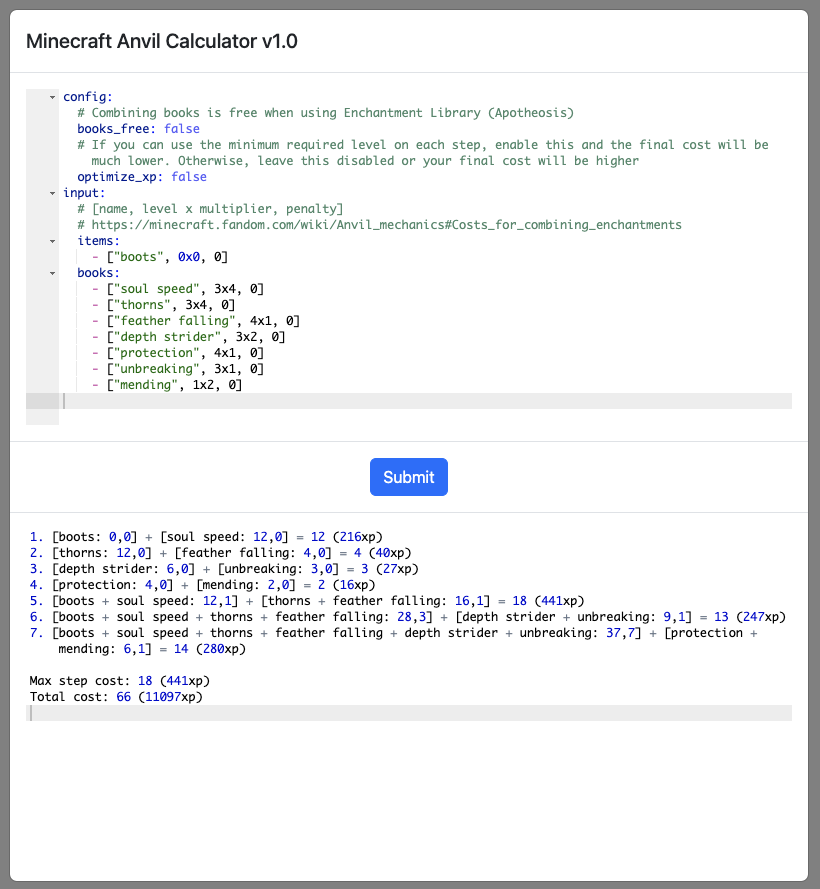

<p align="center">
    
    <p align="center">
        Optimal enchantment order calculator for modded Minecraft
    </p>
</p>


## Features

- Minimalistic, text-based UI, optimized for fast typing
- No fixed item/book limit; duplicate-heavy inputs scale especially well
- Custom prior work penalty
- User-defined enchantments
- Optimize for using all levels at once, or the exact levels for each step
- Free books mode (Apotheosis)

## Usage

#### Web version (recommended)

Just head over to https://virb3.github.io/anvil-calc/.

#### Binary version

Build the native command-line program with Rust:

```bash
cargo build --release
```

Then, simply run it from `target/release/anvil-calc`. Make sure `config.yml` is in the current working directory and customized with your enchantments. The binary is roughly 2x faster than the web version, but this is usually insignificant.

## Screenshot

<p align="center">
	
</p>

## Technical details

The solver uses grouped multiset dynamic programming with sparse Pareto frontiers over prior-work counts. Mechanically interchangeable pieces share a mixed-radix count dimension instead of being treated as separately labelled subsets. It considers every relevant binary merge tree while discarding states that cannot improve either cost or resulting work count. Runtime therefore depends primarily on the number and multiplicity of distinct `(value, prior work, type)` groups rather than only the raw piece count.

The `optimize_per_step` setting selects between two different resource strategies:

- `false` minimizes the sum of the level costs displayed by the anvil. Use this when earning all required levels before starting the sequence.
- `true` minimizes raw XP points, assuming you earn exactly the required number of levels before each operation and spend down to level 0 each time.

Minecraft's XP curve is nonlinear, so these strategies can produce different optimal orders. Results show both the XP required when all levels are funded up front and the sum required when every operation is funded separately.

The same solver is available as a native binary and as a browser-native WebAssembly ES module. The web version is completely client-side and requires no server-side calculation.

Reference: https://minecraft.fandom.com/wiki/Anvil_mechanics

## Similar

- https://github.com/kkchengaf/Minecraft-Enchantment-Order-Calculator
- https://github.com/kkchengaf/Minecraft-Enchantment-Order-Java
- https://github.com/iamcal/enchant-order
- https://github.com/aviettran/minecraft-anvil-calc
