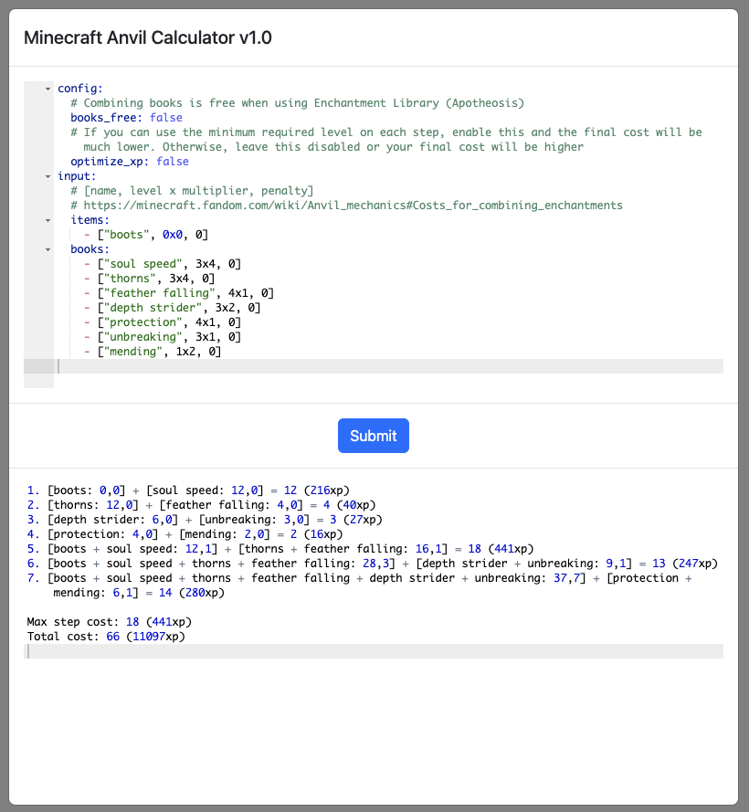

<p align="center">
    
    <h1 align="center">anvil-calc</h1>
    <p align="center">
        Optimal enchantment order calculator for modded Minecraft
    </p>
</p>


## Features

- Minimalistic, text-based UI, optimized for fast typing
- Up to 15 items/books
- Custom prior work penalty
- User-defined enchantments
- Optimize for XP rather than levels
- Free books mode (Apotheosis)

## Usage

#### Web version (recommended)

Just head over to https://virb3.github.io/anvil-calc/.

#### Binary version

You'll need to compile the program using Rust:

```bash
cargo build --release
```

Then, simply run it from `target/release/anvil-calc`. Make sure `config.yml` is in the current working directory and customized with your enchantments. The binary is roughly 2x faster than the web version, but this is usually insignificant.

## Screenshot

<p align="center">
	
</p>

## Technical details

This tool is an extremely optimized bruteforcer written in Rust and compiled for WebAssembly. It is completely client-side and no server is required.

There are multiple heuristics in the code, which allows certain sub-optimal paths to be skipped. The most significant speedup is achieved by caching all input and output items, which allows not only repeated calculations to be avoided, but also sub-optimal ones to be completely skipped.

Reference: https://minecraft.fandom.com/wiki/Anvil_mechanics

## Similar

- https://github.com/kkchengaf/Minecraft-Enchantment-Order-Calculator
- https://github.com/kkchengaf/Minecraft-Enchantment-Order-Java
- https://github.com/iamcal/enchant-order
- https://github.com/aviettran/minecraft-anvil-calc